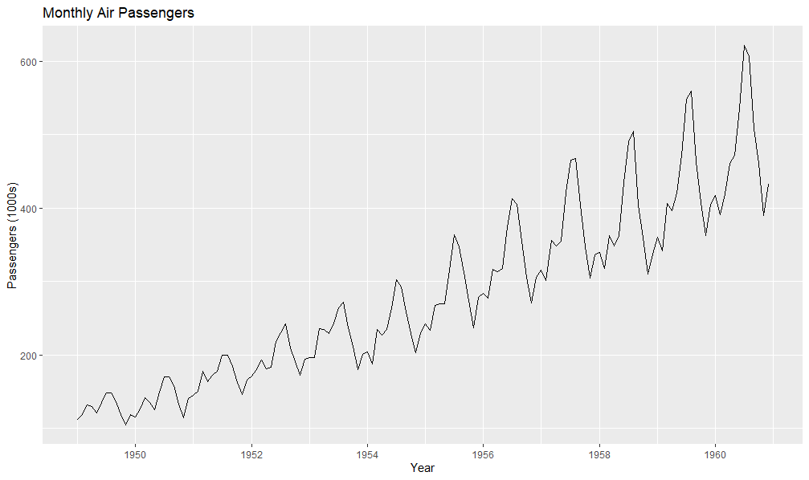
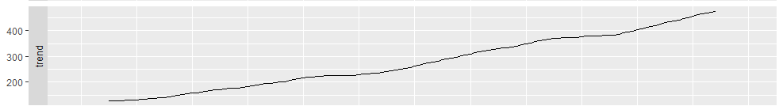
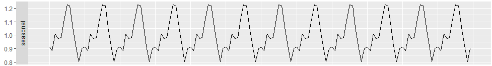
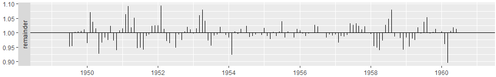
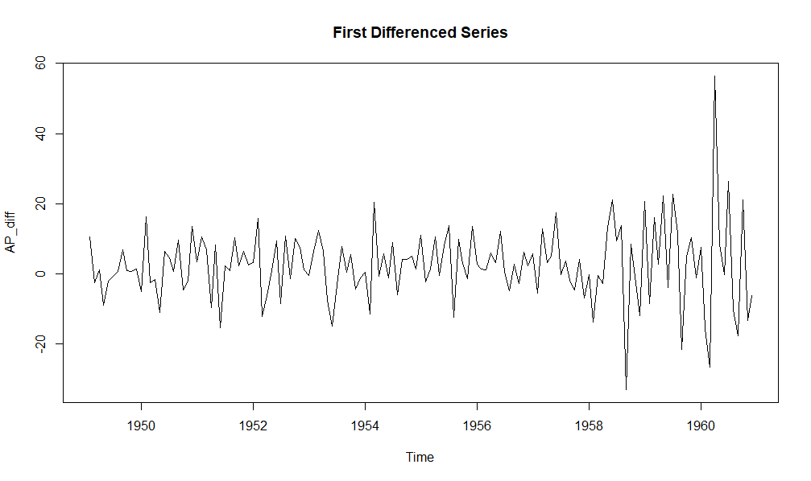
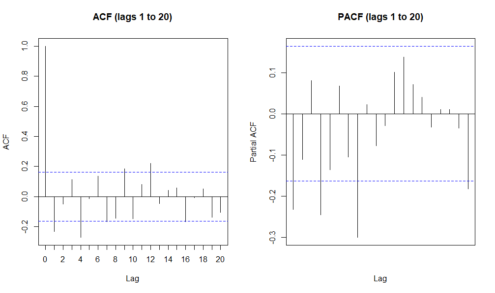
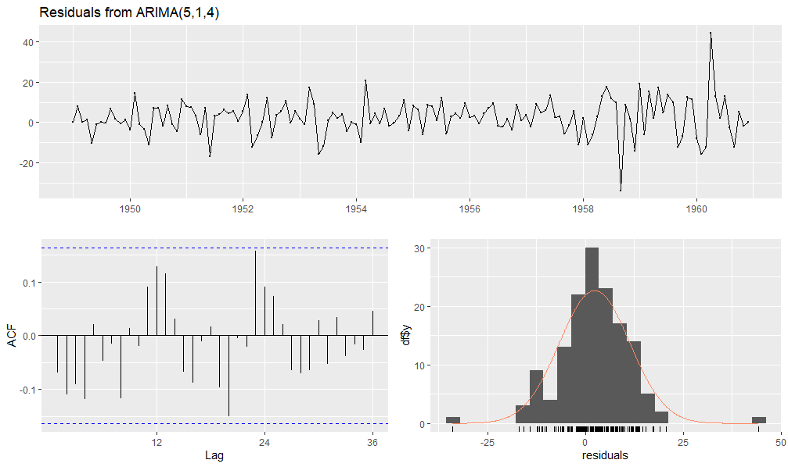
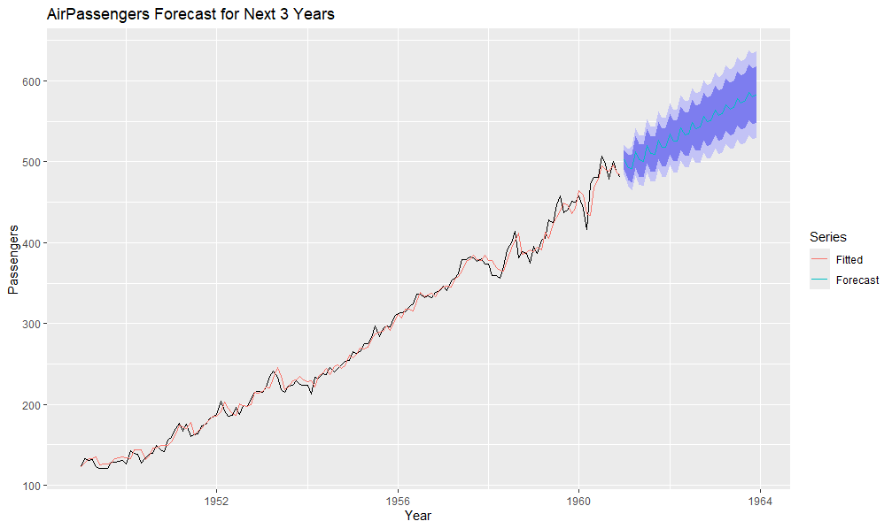

# AirPassengers Forecasting using Box–Jenkins (ARIMA)

## Overview
This project applies the **Box–Jenkins methodology** to analyse and forecast the
**seasonally adjusted AirPassengers** time series. The final ARIMA model is used
to generate **three-year forecasts**, providing insight into future trends in
air travel demand.

---

## Dataset
- Dataset: `AirPassengers` (monthly airline passenger numbers)
- Frequency: Monthly
- Approach: Seasonal adjustment applied prior to ARIMA modeling

---

## Exploratory Data Analysis

### Raw Time Series


The raw series shows:
- A strong upward trend
- Increasing seasonal variation over time

This indicates a **multiplicative seasonal pattern**, motivating multiplicative
decomposition and seasonal adjustment before ARIMA modeling.

---

### Decomposition


#### Trend Component
The trend shows steady long-run growth in passenger numbers, confirming the
upward movement observed in the raw plot.

#### Seasonal Component


A consistent repeating yearly pattern confirms strong seasonality. Since standard
ARIMA models do not directly model seasonal effects without seasonal terms, this
analysis proceeds using a **seasonally adjusted series**, created via:

```r
seasadj(decompose(AirPassengers, type = "multiplicative"))
```

#### Remainder Component


The remainder fluctuates randomly around 1 with no clear structure, suggesting
trend and seasonality explain most of the variation.

---

## Stationarity Check

### Augmented Dickey–Fuller Test (Original / Adjusted Series)
The ADF test yields p-value ≈ 0.3847, so we fail to reject the null hypothesis
of non-stationarity. This indicates differencing is required.

### First Difference


After first-order differencing, the ADF test yields p-value = 0.01, allowing
rejection of the null hypothesis and indicating the series is now stationary.

---

## ACF and PACF Analysis


Significant spikes at lags 1 and 4 in both ACF and PACF suggest an ARIMA(4,1,4)
as a reasonable starting point. Neighbouring models (p, q ± 1) are also evaluated.
Additionally, based on notable higher-lag spikes, ARIMA(20,1,12) is included for
comparison.

---

## Model Selection

Candidate models are compared using AIC and BIC.

- Lowest **AIC**: **ARIMA(5,1,4)** (best predictive fit)
- Lowest **BIC**: **ARIMA(3,1,3)** (most parsimonious)

This project selects **ARIMA(5,1,4)** due to its superior AIC and forecasting focus.

---

## Diagnostics

### Residual Analysis


Residuals fluctuate around zero but show some clustering. The ACF indicates minor
remaining autocorrelation (notably around lag 8), and the histogram shows slight
skewness with outliers.

### Ljung–Box Test
The Ljung–Box test yields p-value ≈ 0.02698, rejecting the null hypothesis of
independent residuals. This suggests statistically significant autocorrelation
remains and the model does not fully capture all structure in the data.

---

## Drift Inclusion
A drift term was assessed and found to be statistically significant (t ≈ 7.85),
so it is included in the final forecasting model.

---

## Forecasting (Next 3 Years)

Three-year monthly forecasts with 95% confidence intervals show continued growth
in passenger demand and increasing uncertainty over time.



The forecast plot shows a clear continuation of the upward trend with widening
confidence intervals.

---

## Technologies Used
- R
- `forecast`, `tseries`, `ggplot2`

---

## License
This project is licensed under the MIT License.
